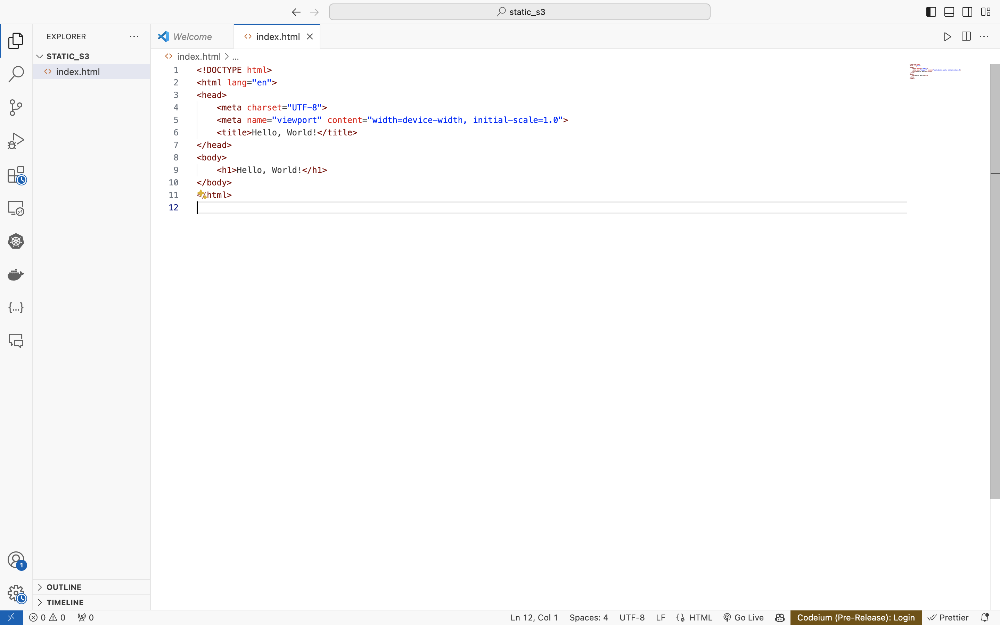
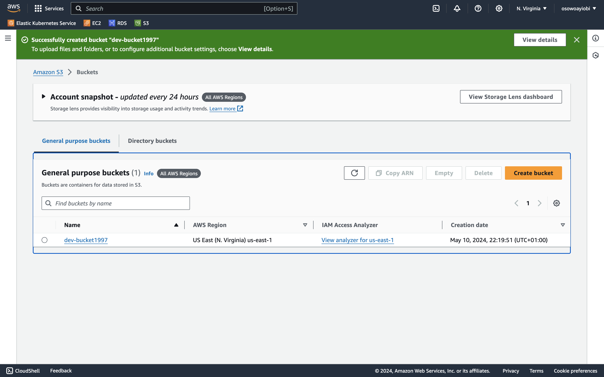
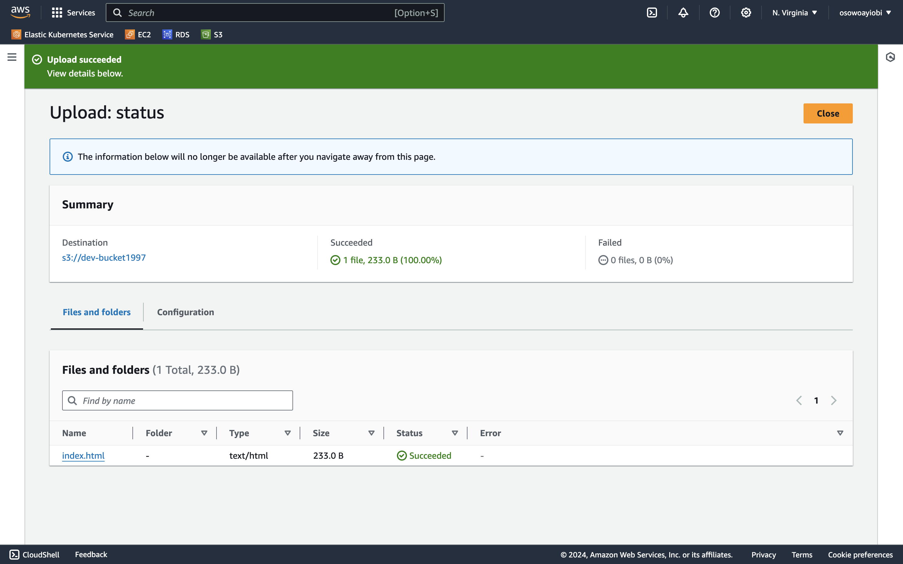
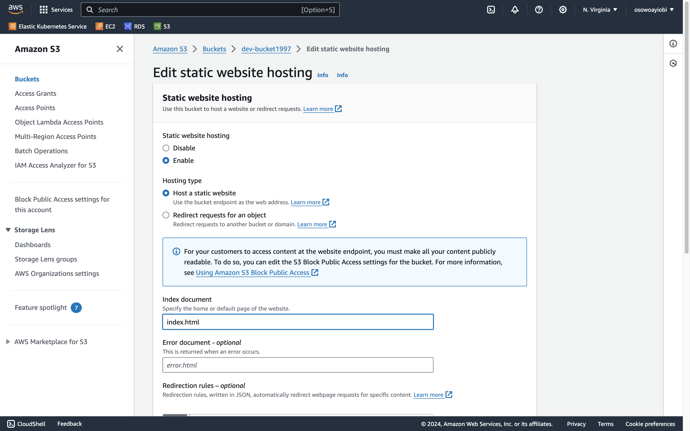
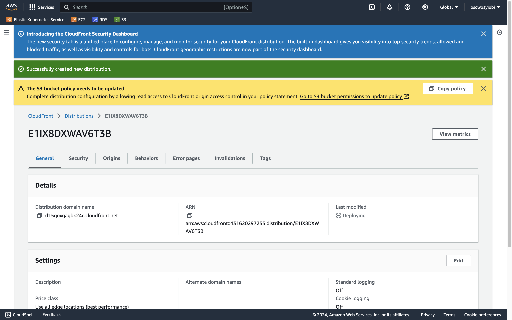
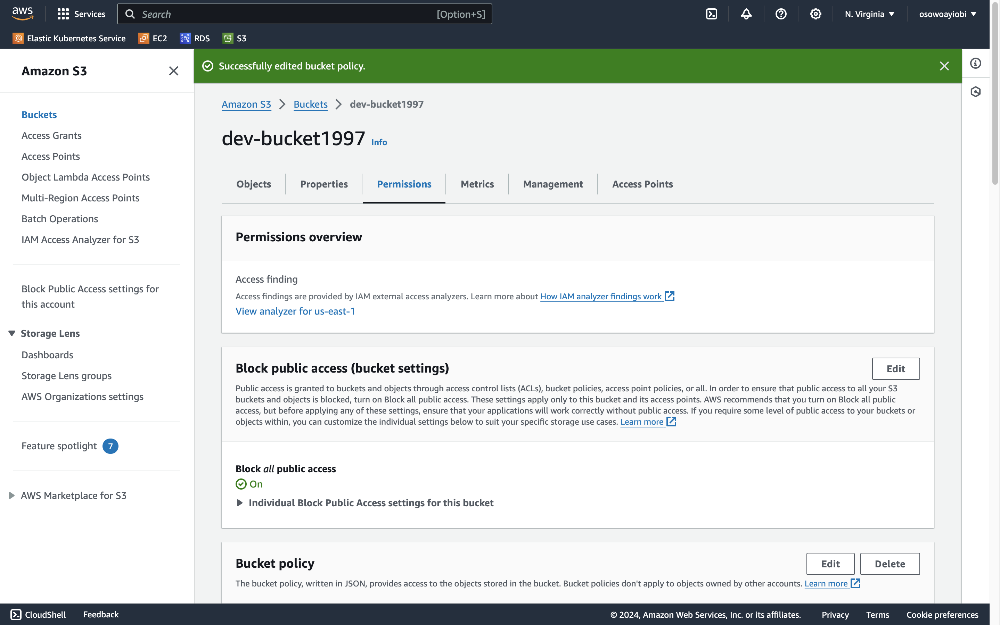
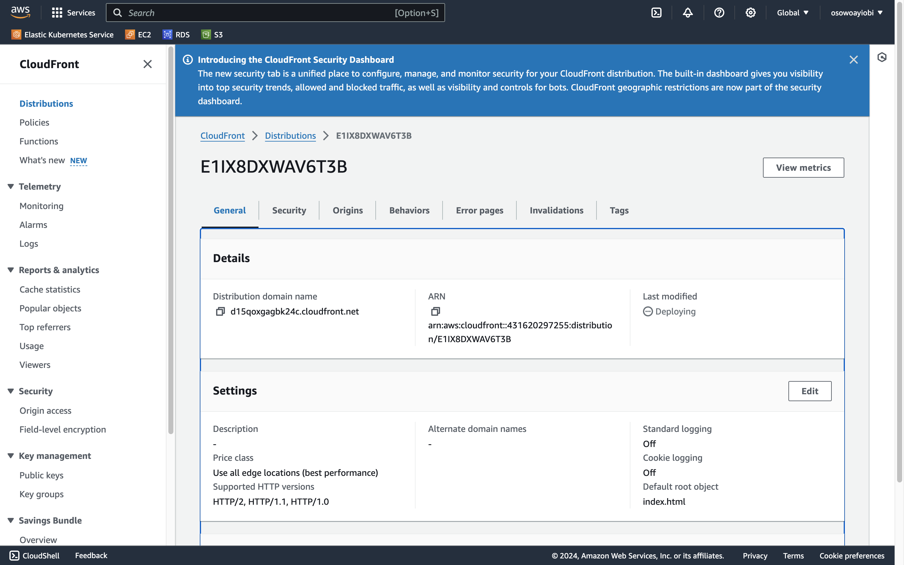
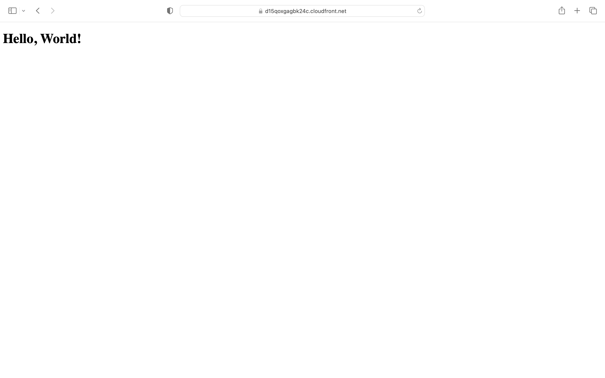

# Project Description

## Overview

The project involves creating a static website and hosting it on an Amazon S3 bucket. However, the twist is to ensure that the S3 bucket remains private while allowing public access to read the contents. To achieve this, a public read policy will be assigned to the S3 bucket. Additionally, CloudFront will be utilized as a Content Delivery Network (CDN) to enhance the performance and availability of the static website.

## Key Features

- **Static Website**: The project will involve creating a simple static website consisting of HTML, CSS, JavaScript, and any necessary assets.
- **S3 Bucket Hosting**: The website files will be hosted on an Amazon S3 bucket, ensuring durability, scalability, and high availability.
- **Private Bucket with Public Read Access**: Despite the S3 bucket being private, a public read policy will be configured to allow public access to view the website contents.
- **CloudFront CDN Integration**: CloudFront will be used to distribute the website content globally, reducing latency and improving the website's performance for users worldwide.
- **Security**: Despite the public read access, security measures such as SSL/TLS encryption and other AWS security features will be implemented to protect the website and its users.

## Technologies Used

- **Amazon S3**: For hosting the static website files in a scalable and durable storage solution.
- **Amazon CloudFront**: As a CDN to deliver the website content with low latency and high transfer speeds.
- **HTML, CSS, JavaScript**: For developing the static website content and user interface.
- **AWS IAM**: For managing access permissions and policies for the S3 bucket and CloudFront distribution.
- **SSL/TLS**: For encrypting data in transit and ensuring secure communication between users and the website.

## Steps Followed
1. created my html file.

2. created my s3 bucket

3. uploade html file

4. enable static hosting

5. created cloud front

6. edited policy

7. Reterive domain

8. output on browser
